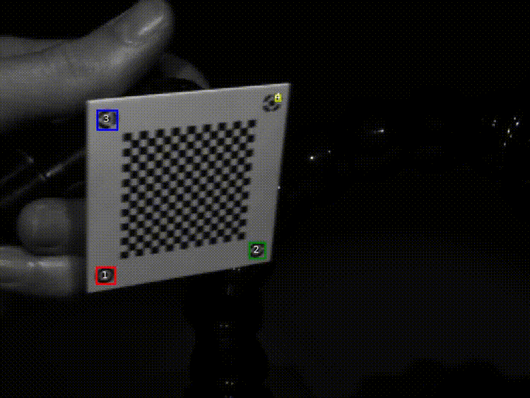
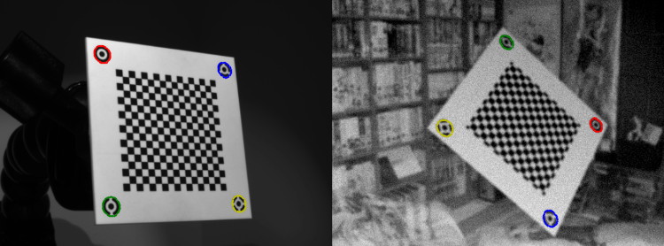

# Fiducial Detect
This project is a deep learning based fiducial marker detection "algorithm". The gif below is a screen capture of the results in the `stream.ipynb` notebook:

Detection problems in deep learning require ground truth data for training. But, no data were annotated manually in this project. 

All training data was synthetic and generated. The calibration board was modeled using the `Shapley` library in `gen_cb.ipynb`. Random homographies (which were constrained to be mostly in the FOV) were applied and the calibration board was painted on random images scraped from the Bing search engine as shown in `data.ipynb`. 

The validation data consisted of real images of the calibration board. Detection of the fiducial markers were done automatically via some old automated algorithms I wrote in my [camera_calib](https://github.com/justinblaber/camera_calib) library. I do conceed that if these didn't exist, manual annotation would have been required.

On the left is a real validation image and on the right is a synthetic training image.

Some things I'm proud of in this project:

* It uses completely synethetic data for training and actually WORKS for real data. I do acknowledge this is a ridiculously simple geometry/problem (a flat calibration board), but the idea that a deep learning problem was "solved" with completely synthetic data is incredibly cool.
* It uses [nbdev](https://github.com/fastai/nbdev) which is an absolutely amazing library which makes developing in jupyter notebooks way more practical, enjoyable and FUN. 
